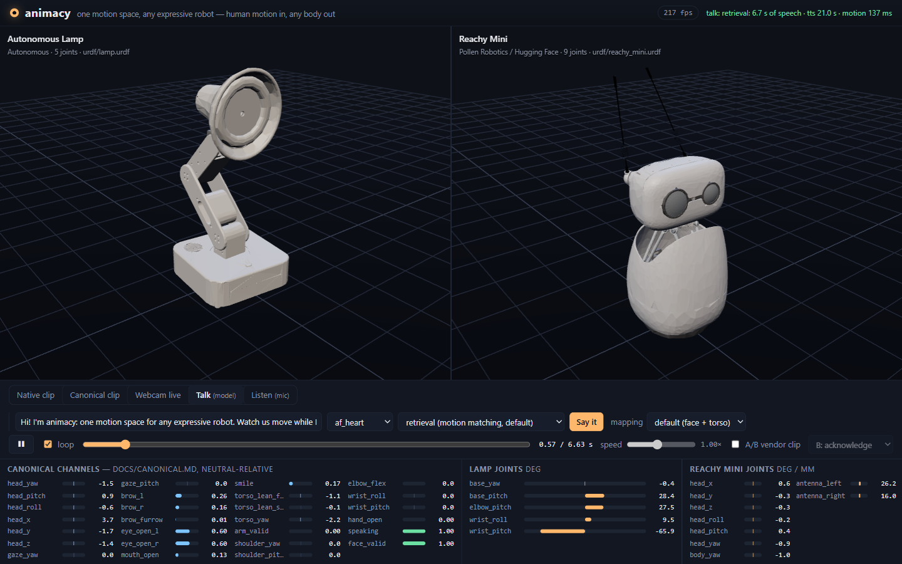
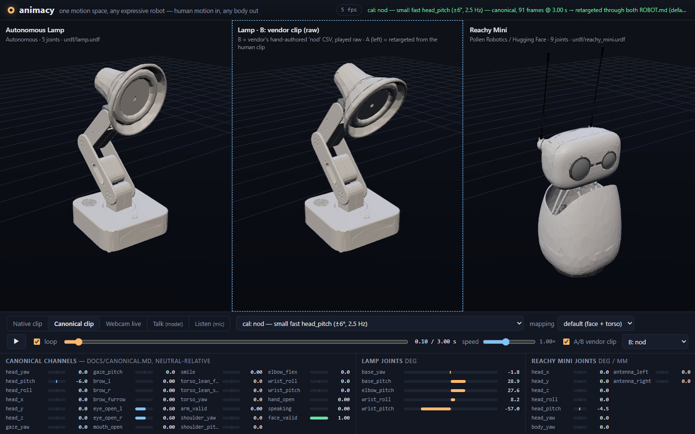
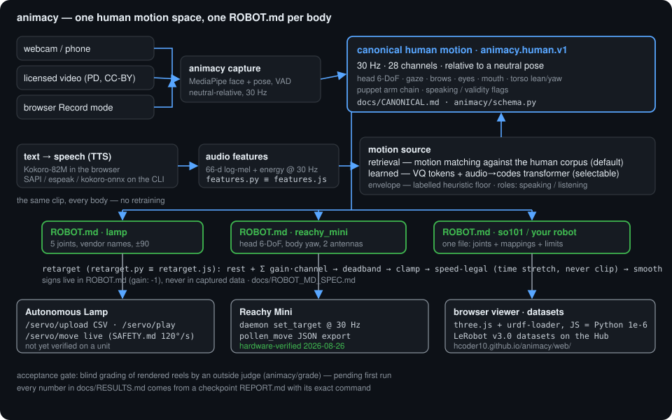

# animacy

**The open interaction layer for expressive robots: human motion in, any robot's motion out — one `ROBOT.md` per body, no retraining.**

**Live demo:** https://hcoder10.github.io/animacy/web/ — the Autonomous Lamp and the Reachy Mini side by side, playing their vendors' own clips, human motion retargeted through each robot's `ROBOT.md`, your webcam live, and a talk mode where the robot speaks (TTS in the browser) and moves in sync.



What it is, in six lines:

1. **One canonical human motion space** (`docs/CANONICAL.md`): 28 channels at 30 Hz — head 6-DoF, gaze, brows, mouth, torso, a puppet arm, a speaking flag. Capture writes it, models predict it, robots never see anything else.
2. **One `ROBOT.md` per robot** (`docs/ROBOT_MD_SPEC.md`): joints, limits, rest pose, safety ceiling and a linear mapping from canonical channels — signs are fixed there, never in data. `animacy check` validates it.
3. **Capture from any video or webcam** (`animacy capture`, MediaPipe face + pose + VAD), or record in the browser and import.
4. **A browser demo on the real URDFs** (three.js + urdf-loader; the JS retargeter equals the Python one to 1e-6).
5. **Speech-driven motion**: a VQ tokenizer + audio→codes transformer, and a retrieval (motion-matching) baseline that ships as the default; both run in the page.
6. **Runs on the real Reachy Mini today** (hardware-verified 2026-08-26) and writes exactly the CSV the Autonomous Lamp's `/servo/upload` accepts (validated against a mirror of that route's checks; not yet run on a Lamp).

## 60-second quickstart

```bash
git clone https://github.com/Hcoder10/animacy && cd animacy
pip install -e ".[capture,urdf]"           # Python >= 3.10; mediapipe + opencv for capture, yourdfpy for URDF checks

animacy check robots/lamp                  # validates ROBOT.md + URDF (also: robots/reachy_mini, robots/so101)

# a person talking on video -> a canonical clip (30 Hz parquet + 16 kHz wav + meta)
animacy capture --source path/to/talk.mp4 -o data/clips/talk --duration 60
# or your webcam:  animacy capture --source 0 -o data/clips/me --preview

# the clip -> the Lamp's own recording format (speed-legal, 30 Hz)
animacy retarget --robot lamp --clip data/clips/talk -o out/talk.csv --format autonomous_os_csv
# the same clip -> a Reachy Mini move (Pollen's recorded-move JSON)
animacy retarget --robot reachy_mini --clip data/clips/talk -o out/talk.json --format pollen_move

# the viewer (static site, no build)
python -m http.server 8000                 # -> http://localhost:8000/web/

# a real Reachy Mini: speak and move in sync (pip install requests; the daemon URL is in robots/reachy_mini/ROBOT.md)
animacy say "Hi, I'm animacy." --robot reachy_mini --url http://<reachy>:8000 --source envelope
# --source retrieval | model use a training checkpoint dir (--checkpoint checkpoints/v1, from `python -m animacy.model.train`)
```

`animacy mirror --source 0 --robot reachy_mini --sink reachy_daemon --url http://<reachy>:8000` drives the robot from your webcam in real time (30 Hz, latest-sample-wins, read-back logged).

## Robots

| robot | vendor · license | joints | URDF | native clips | signs verified in sim | verified on hardware |
|---|---|---|---|---|---|---|
| `lamp` — Autonomous Lamp | Autonomous · Apache-2.0 | 5 (vendor servo names) | from the vendor CAD (`lamp.glb` armature pivots, per-part STLs), [notes](robots/lamp/urdf/README.md) | 31 vendor recordings, verbatim | yes — against the vendor's device-measured notes and all 31 clips ([previews](robots/lamp/urdf/preview/contact_sheet.png)) | **no** (no unit on hand) |
| `reachy_mini` — Reachy Mini | Pollen Robotics / Hugging Face · Apache-2.0 | 9 (head 6-DoF, body yaw, 2 antennas) | serial visualization chain over Pollen's meshes | 16 of Pollen's 85 moves, converted | yes | **yes, 2026-08-26** — [evidence](docs/evidence/reachy_sim2real_20260826.md) (every axis read back within a few degrees; owner confirmed all five directions) |
| `so101` — SO-101 arm | TheRobotStudio / LeRobot · Apache-2.0 | 6 | vendor URDF, mesh paths only | — | yes (FK only) | no |

A new robot is one folder: `ROBOT.md` + a URDF. See **Add your robot in one file** below.



## Add your robot in one file

`docs/ADD_A_ROBOT.md` is written for a person *or* a Claude Code / Codex session: copy `robots/_template`, drop in a URDF, fill the joint table from the vendor's spec (names, limits, rest, `max_speed` from the vendor's safety file), write the `default` mapping *by function* (gaze → whatever points the face, lean → base joints, brows → the body's most legible affect channel), run `animacy check` until it passes, eyeball it in the viewer, fix directions with `gain: -1`. No Python. The Lamp and Reachy profiles are the worked examples; `robots/lamp/urdf/README.md` shows what deriving a URDF from vendor CAD looks like when the vendor ships none.

## For Autonomous OS

The Lamp and the Reachy Mini are both official Autonomous OS bodies, and animacy's `ROBOT.md` deliberately mirrors theirs (same joint names, same `max_speed` source). Autonomous OS's own `docs/not-built-yet.md` lists four things; here is how animacy maps onto each. Owner walkthrough: [`docs/AUTONOMOUS_OS.md`](docs/AUTONOMOUS_OS.md).

**(a) "A Hub dataset in Pollen's emotion-library format, so a move recorded on either body plays on both."**
animacy makes cross-body moves by construction: a move is a *human* clip, and each body plays it through its own `ROBOT.md`.

```bash
animacy retarget --robot reachy_mini --clip data/clips/<clip> -o out/<clip>.json --format pollen_move        # Pollen recorded-move JSON: {"description","time",[{"head":4x4,"antennas":[l,r],"body_yaw"}]}
animacy retarget --robot lamp        --clip data/clips/<clip> -o out/<clip>.csv  --format autonomous_os_csv  # hal/recordings CSV: timestamp,<joint>.pos
```

Both bodies already share one dataset on the Hub: [`squaredcuber/animacy-lamp-lerobot`](https://huggingface.co/datasets/squaredcuber/animacy-lamp-lerobot) and [`squaredcuber/animacy-reachy-mini-lerobot`](https://huggingface.co/datasets/squaredcuber/animacy-reachy-mini-lerobot) are the *same* 53 human episodes (14.9 min) retargeted to each robot, LeRobot v3.0, with the speech features alongside (`docs/LEROBOT.md`). Pollen's own library also imports: `scripts/pollen_npz_to_joints.py` converts `pollen-robotics/reachy-mini-emotions-library` moves into animacy joint tables (that is what plays as "native" Reachy clips in the viewer). What animacy does **not** do: turn a robot-authored move back into human motion — a Pollen move does not become a Lamp move.

**(b) "Community moves on Reachy … a move you recorded and pushed to the Hub."**
`animacy capture` (webcam, phone video, or the viewer's Record mode + `animacy import-browser`) → `animacy retarget --format pollen_move` writes the file format their driver loads. Pushing it as a `reachy_mini_community_moves` dataset is a plain `huggingface_hub` upload; animacy's own pushers (`scripts/push_hf.py`, `scripts/export_lerobot.py --push`) publish the human corpus and the LeRobot datasets and refuse any clip without a license record.

**(c) "Recorded animations under the safety gate."**
animacy makes the design call their note describes: **stretch time, never clip or drop.** `retarget_clip` widens only the frame gaps that would exceed `max_speed` (the same rule as their `recording_timing.stretch_timeline`), then a causal `rate_limit` guarantees legality exactly — 0 speed-cap violations on every clip in `docs/RESULTS.md`. `animacy.export.validate_autonomous_os_csv` mirrors `hal/routes/servo.py:upload_servo_recording` plus a per-joint speed check, so a file that passes here is accepted there. Live streaming (`/servo/move`) is held to `SAFETY.md motion.max_speed = 120°/s` by their gate; the profile records both ceilings (`robots/lamp/ROBOT.md`).

**(d) "A live policy behind `POST /policy/run`."**
Their endpoint is a dry-run recorder today (`{"policy","task"}` → `state: "dry_run"`). animacy's live loop is the executor shape it needs: `animacy say "<text>" --robot lamp --sink autonomous_os_hal --url http://<lamp>:5001` turns text into speech, speech into canonical motion (retrieval or the learned model), motion into `/servo/move` frames at 30 Hz through the Lamp's `ROBOT.md` and under their speed gate, while the audio plays. `docs/AUTONOMOUS_OS.md` sketches the `PolicyService` adapter. **Not yet run on a Lamp.**

## Results (model v1, 2026-08-27)

Every number is copied from `docs/RESULTS.md`, which in turn cites a `checkpoints/<run>/REPORT.md` with the exact training command. Held-out = a speaker the model never saw.

- **Data:** 6 license-verified clips, 20.5 min, 14.95 min face-valid with audio. Small; a 10× fetch is in progress.
- **Tokenizer** (VQ-VAE, 512 × 64, one code per 2 frames): 512/512 codes used, val MAE 0.35 vs 0.71 for predict-the-mean; round-trip r = 0.8–0.9 on head/torso/brows on the held-out speaker. Dead-code revival was required — the stock EMA quantiser collapsed to one code at this data size.
- **Audio → motion, held out:** on one held-out speaker (obama_2015) the model beats the unigram floor (code NLL 6.031 vs 6.167) and its shuffled-audio control on head-beat recall (0.617 vs 0.497) and precision (0.52 vs 0.40); on the other (kende) it does not (NLL 6.276 vs 6.162 floor; beat-recall margin 0.03, inside noise). Generated motion is too restless on both (stillness 0.013–0.025 vs 0.10 in the truth) because codes are sampled independently per step. On the obama hold-out the model's expected motion correlates with the unseen speaker's truth at r = 0.48 on `head_pitch` (−0.02 with shuffled audio), 0.40 on `head_z`, 0.40 on `mouth_open`.
- **Therefore retrieval ships as the default motion source**; the learned model is selectable; v2 is an autoregressive decoder on the larger dataset, and its numbers will be appended whatever they are.
- **Retarget legality:** 0 speed-cap violations on lamp and reachy after the `rate_limit` fix.
- **Sim-to-real:** Reachy Mini, physical unit, canonical clip → `ROBOT.md` → daemon at 30 Hz; every commanded axis read back within a few degrees, owner confirmed directions; `animacy say` ran on the robot with audio in sync (`docs/evidence/reachy_sim2real_20260826.md`).
- **Browser:** JS retargeter = Python to 1e-6 on 240 random frames × 2 robots × 2 modes; 240 fps on an RTX 5080 laptop, 8–12 fps under software rendering.

**Acceptance criterion — the blind-grader gate (`animacy/grade`), status: pending first run.** An outside judge (Kimi K3 through the local `kimi` CLI) watches reels of short robot clips rendered through the same viewer, blind: the clip→origin map is sealed in a manifest the judge never sees, and the rubric carries no project vocabulary. The pass rule is owned by the gate and may not be weakened elsewhere: for each robot, the `model` source must score overall ≥ 8.0 on all five movements, using the mean over seeds (best-of-seeds is reported, never used). No run has been made yet, so no claim about passing it appears anywhere in this repo.

## Data

- Human corpus: [`squaredcuber/animacy-human-motion`](https://huggingface.co/datasets/squaredcuber/animacy-human-motion) — canonical clips (`motion.parquet`, `audio.wav`, `meta.json`) with sources and licenses listed verbatim in the card.
- License policy (`scripts/fetch_sources.py`, `scripts/push_hf.py`): public-domain and CC-BY talking-head video only, license verified from metadata, ND refused, evidence copied into every clip's `meta.json`; nothing without a license record is pushed. Your own webcam clips carry `license: self` (CLI) or CC-BY-4.0 (browser Record mode).
- Robot-space datasets for imitation learning (`animacy lerobot --robot <name> --out <dir> --validate --push <repo>`): the two LeRobot v3.0 datasets above (`observation.state`/`action` in each robot's units, 66-d speech features + speaking flag as `observation.environment_state`, validated with the real `LeRobotDataset` loader).
- The vendors' hand-authored clips (Lamp 31, Pollen's Reachy library) are **not** training data; they are the envelope each retarget is tuned to and the A/B in the viewer.

## Architecture



```
animacy/schema.py      the canonical frame (CHANNELS is the single source of truth)
animacy/capture.py     video/webcam -> canonical clips        animacy/mirror.py   live webcam -> robot
animacy/profile.py     ROBOT.md parser + `animacy check`      animacy/retarget.py  the mapping core (== web/js/retarget.js)
animacy/export.py      Lamp CSV, Pollen move JSON             animacy/sinks.py     Reachy daemon, Autonomous HAL
animacy/features.py    audio features (== web/js/features.js) animacy/model/       vq, a2m, retrieval, train, ONNX export
animacy/serve.py       `animacy say`: text -> TTS -> motion -> robot, in sync
animacy/grade/         the blind acceptance gate               web/                 the viewer (static, no build)
robots/<name>/         ROBOT.md + urdf/ + meshes/ + clips/     docs/                the contracts and the evidence
```

## Status — what is done, what is not

Done and verified: the canonical schema and `ROBOT.md` contract with `animacy check`; capture from video/webcam/browser; retargeting with an exact speed-cap guarantee; Lamp and Reachy Mini URDFs; Reachy Mini sim-to-real on a physical unit; the browser viewer with talk mode (Kokoro TTS in the page); two LeRobot datasets validated with the real loader; 170+ tests.

Not done, or not verified — read before quoting anything above:

- **No Lamp hardware yet.** The Lamp URDF, signs, CSV export and HAL sink are verified against the vendor's CAD, device notes, recordings and route code, not on a unit. The vendor's joint values are calibration-span units (`RANGE_M100_100`), treated as degrees (~1.07°/unit yaw, ~1.16°/unit roll, pitch joints calibration-dependent) — directions and topology are exact, amplitudes approximate (`robots/lamp/urdf/README.md`).
- **The learned model does not yet beat its floors on every held-out speaker**; retrieval is the default. The blind-grader gate has not been run.
- **Listen mode** (microphone → causal model) is experimental. Reachy antenna out/in geometry has not been eyeballed on hardware (the mapping is documented either way). SO-101 is sim only.
- A robot-authored move cannot be moved to another body (no inverse retarget).
- The dataset is small (20.5 min); the v2 model waits on the larger fetch.

## License and attributions

- animacy: **Apache-2.0** (code, docs, profiles) except where a folder carries its own license file.
- Autonomous Lamp CAD, recordings and joint conventions: [Autonomous OS](https://github.com/autonomous-ai/autonomous-os) `robots/` tree, Apache-2.0 (`robots/lamp/meshes/ATTRIBUTION.md`).
- Reachy Mini description, meshes and emotion library: Pollen Robotics / Hugging Face, Apache-2.0.
- SO-101: TheRobotStudio SO-ARM100, Apache-2.0 (`robots/so101/meshes/ATTRIBUTION.md`).
- LeLamp (GPL-3.0) was read as a kinematic reference for the Lamp's ancestry only; no LeLamp file or mesh is in this repository.
- Video sources: public domain and CC-BY only, credited per clip in the dataset card; captured motion of the author under `license: self`.

Lineage: [reachy-duplex](https://github.com/Hcoder10/reachy-duplex) (full-duplex speech + learned motion on a physical Reachy Mini). Built for the Autonomous Open Source Grant, August 2026.
